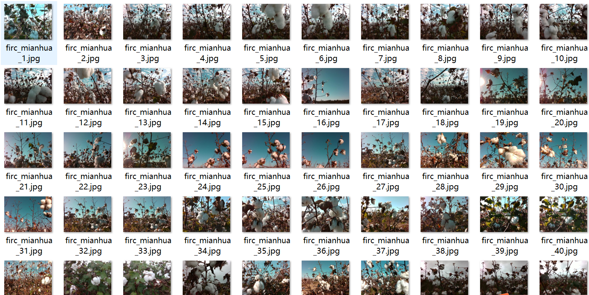
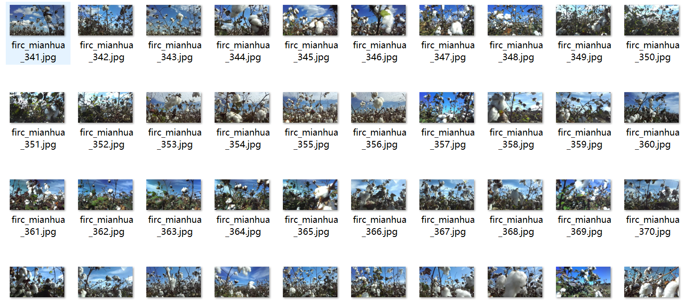
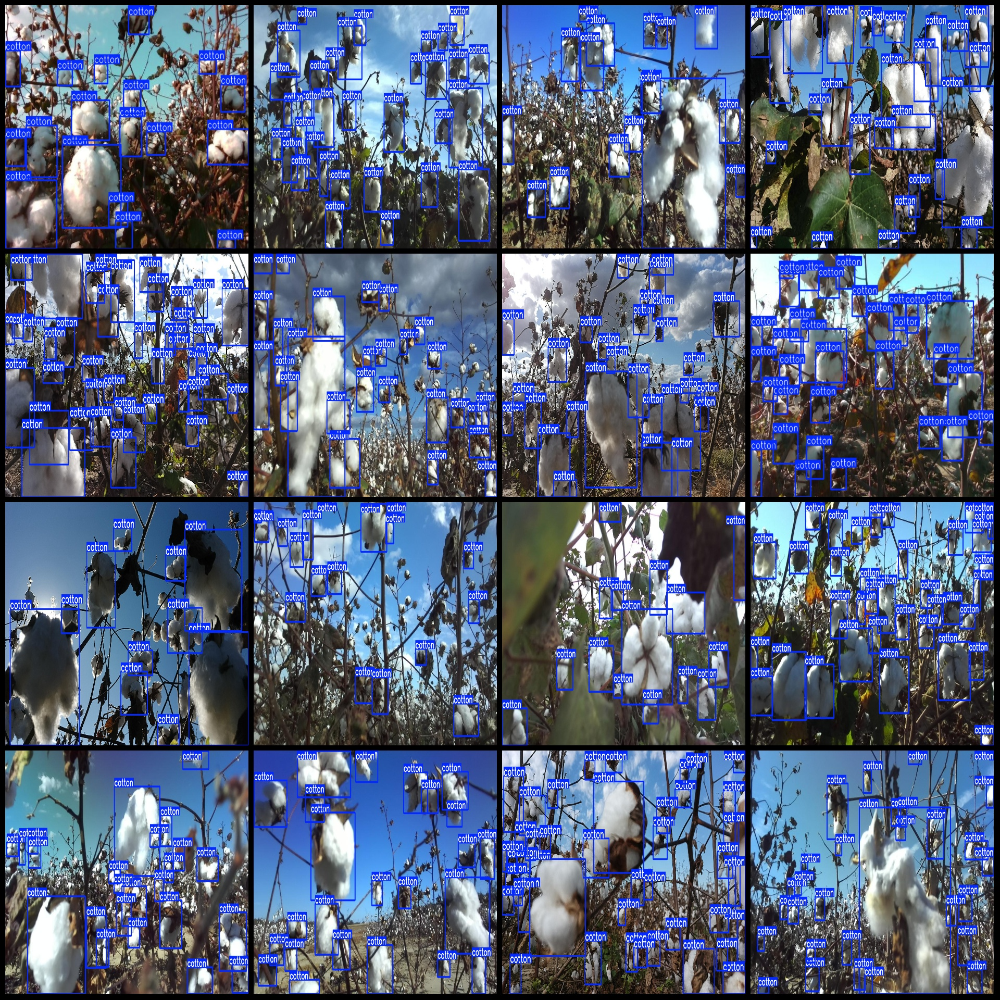
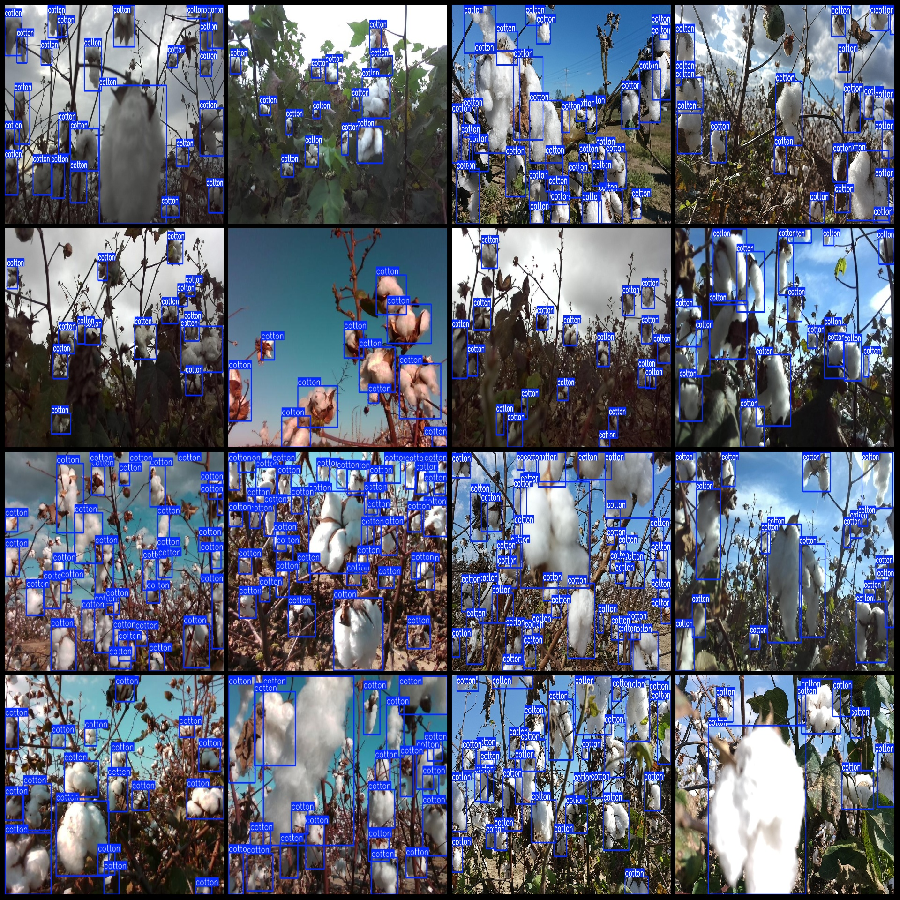

# Cotton Detection Dataset (VOC+YOLO format, 767 images in one category)

Please note that the dataset labels are for mature cotton, and unripe cotton is not labeled because it has not split.
The dataset format: Pascal VOC format + YOLO format (txt file without segmentation path, only contains jpg images along with VOC format xml files and YOLO format txt files).
Number of images (jpg file count): 767
Number of labels (xml file count): 767
Number of labels (txt file count): 767
Number of label categories: 1
Label category name (notice that the order of labels in YOLO format does not match this, but refer to the "labels" folder's "classes.txt"): ["cotton"]
Each category has a number of boxes:
- Number of boxes for "cotton": 17515
Total number of boxes: 17515
Image resolution: Multi-resolution images, such as 1280x720, 1920x1080, etc.
Annotation tool used: labelImg
Annotation rule: Draw bounding boxes for each class.
Important notes: None
Special declaration: This dataset does not guarantee the accuracy of the trained models or weight files.
Image preview:
Annotation example:

## Images

Here is a pay link on Stripe ( https://buy.stripe.com/3cs8yP7sY87d0vu9AB ). Please contact me lonlonago@foxmail.com after funding $89, and I will send you a complete data files , thank you!

